# DOGE FORGE

## A Mining-First Token Economy on Tempo

**Whitepaper · Version 1.1**

---

> "Validate the engine first, plug into Tempo rails after."
>
> — *DOGE FORGE design directive*

---

## Abstract

DOGE FORGE is a self-contained token economy built natively on Tempo Chain. It pairs a continuous mining engine with a hybrid trading layer and an on-chain identity registry. Users commit pathUSD (Tempo's canonical stablecoin) into capped, supply-curve-driven mining positions that emit TDOGE — a meme-flavoured but rules-disciplined token with a 210,000,000 hard cap. Every cycle of value flowing through the system feeds liquidity back into the TDOGE / pathUSD pool, while user identity is layered on top through the `.tdoge` registry.

This document specifies the full system: the contracts, the multipliers, the emission curve, the liquidity loop, the trading routes, the identity registry, the security boundaries, and the roadmap. It is written to be fully reproducible from public testnet state.

---

## Table of Contents

1. [Introduction](#1-introduction)
2. [System Architecture](#2-system-architecture)
3. [TDOGE Token](#3-tdoge-token)
4. [Mining Mechanism](#4-mining-mechanism)
5. [Emission Curve](#5-emission-curve)
6. [Harvest Modes](#6-harvest-modes)
7. [Multiplier System](#7-multiplier-system)
8. [Liquidity System](#8-liquidity-system)
9. [Trading Layer](#9-trading-layer)
10. [.tdoge Identity Registry](#10-tdoge-identity-registry)
11. [Token Discovery](#11-token-discovery)
12. [Operational Tooling](#12-operational-tooling)
13. [Security Model](#13-security-model)
14. [Threat Model](#14-threat-model)
15. [Treasury and Fee Policy](#15-treasury-and-fee-policy)
16. [Comparative Analysis](#16-comparative-analysis)
17. [Roadmap](#17-roadmap)
18. [Risks and Disclosures](#18-risks-and-disclosures)
19. [Appendix](#19-appendix)

---

## 1. Introduction

### 1.1 The Tempo Context

Tempo is an EVM-compatible blockchain that targets the Osaka hard fork and reaches sub-second finality through Simplex BFT consensus. It is structured around stablecoin payments: there is no native gas token, transaction fees are paid in any TIP-20 stablecoin, and liquidity for stable-to-stable trading is provided through an enshrined orderbook DEX (a precompile at `0xDEc0…`).

Three properties of Tempo shaped DOGE FORGE materially:

- **Stablecoin-native fees.** Users do not need to acquire a separate gas token. This collapses onboarding friction and makes pathUSD the universal medium of exchange on the chain.
- **Enshrined stablecoin DEX with a tight ±2% price band.** The protocol's own DEX is engineered for stable-to-stable swaps near parity. Volatile assets cannot price against it.
- **Sub-second finality.** Continuous-flow accounting and live-updating UIs are practical. Users feel the loop respond in real time rather than waiting on minute-scale block windows.

DOGE FORGE leans into the first property, designs around the second by deploying its own constant-product AMM for the volatile TDOGE / pathUSD pair, and exploits the third with second-resolution earning displays.

### 1.2 Why DOGE FORGE

The system addresses three observations:

1. **Memetic tokens often lack discipline.** They launch with uncapped supply, ad-hoc emissions, and no mechanism to convert speculative interest into protocol-owned liquidity. DOGE FORGE inverts this: emissions are bounded, supply is hard-capped, and every act of mining contributes pathUSD directly into the TDOGE liquidity pool.
2. **Mining-only economies decay into pure yield extraction.** DOGE FORGE introduces a Harvest Mode lock-up choice and a commitment-size tier so larger and more patient participants are mathematically advantaged. Multipliers compound but are bounded above and below.
3. **Identity is missing on most chains.** A user's address is opaque. DOGE FORGE adds `.tdoge` names as a flat registry (not an NFT collection) where claim fees route directly into liquidity. Identity becomes both a status signal and a deflationary action against pathUSD demand.

### 1.3 Design Principles

| Principle | Effect |
|---|---|
| Hard caps, soft dials | The 210M supply ceiling is immutable; emission rates and bounds are admin-tunable post-launch. |
| Multipliers compose, then clamp | Speed, harvest mode, global, and adaptive multipliers all multiply together but the combined product is clamped to a `[min, max]` band so no parameter combination can blow up emissions. |
| Liquidity grows passively | Users do not need to provide LP. The mining flow itself feeds the pool. |
| Identity is not yield | `.tdoge` IDs confer no mining advantage, no fee discount, no protocol claim. They are status only. |
| Trust boundary is explicit | A single EOA admin holds protocol parameters at launch. The path to multisig is documented, not hidden. |

### 1.4 Reading Guide

This document is split into three layers:

- **Sections 1–6** describe the user-facing system: what mining looks like, the emission curve, harvest modes.
- **Sections 7–11** specify the economic and infrastructure layers: multipliers, liquidity, trading, identity, token discovery.
- **Sections 12–18** cover operations, security, threat model, treasury, comparative analysis, roadmap, and disclosures.

A pure user can read 1–6 and stop. A protocol developer should read everything. A security reviewer should read 1, 4, 7, 8, 13, 14.

---

## 2. System Architecture

### 2.1 High-Level Overview

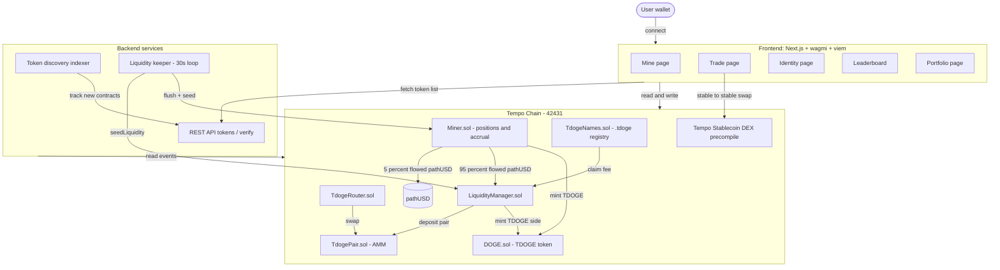

### 2.2 Component Map

| Component | Purpose | Trust |
|---|---|---|
| `DOGE.sol` | TDOGE TIP-20 token, capped + post-cap inflation, 0.1% transfer fee | Admin: tune fee within hard cap (max 0.2%), tune inflation within hard cap (max 5%/yr) |
| `Miner.sol` | Multi-position mining, lazy accrual, harvest cooldown via mode | Admin: tune emission curve, multipliers, sinks, pause |
| `LiquidityManager.sol` | Receives 95% pathUSD share from Miner; mints matching TDOGE; deposits into pair | Admin: set initial price, mint budget, sweep |
| `TdogePair.sol` | Constant-product AMM for TDOGE / pathUSD with 0.30% LP fee | None — immutable pair, standard UniV2 mechanics |
| `TdogeRouter.sol` | One-call swap helper for TdogePair | None — pure utility, no privileged state |
| `TdogeNames.sol` | `.tdoge` identity registry, 5,000 cap, fee routes to LM | Admin: set cost, sink, open/close claims |
| Tempo Stablecoin DEX | Native orderbook for pathUSD ↔ Alpha/Beta/Theta USD | Tempo protocol |

### 2.3 Trust Boundaries

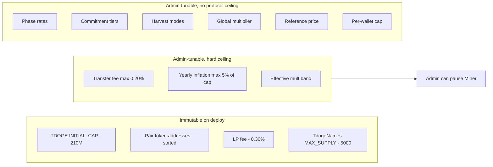

The intention is that the parts a user could be economically harmed by (cap, fee ceiling, inflation ceiling) are immutable or hard-bounded, while the parts that need post-launch tuning (rates, multipliers, caps) remain adjustable. The pause switch is a circuit breaker — it stops new commits and harvests but cannot move user funds.

### 2.4 End-to-End Data Flow

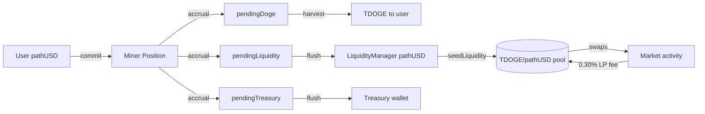

A pathUSD unit entering the system follows a deterministic path: commitment → flow accrual → split into pending counters → flush to either user (via TDOGE mint) or pool (via LM seed) or treasury. Once in the pool, it earns 0.30% LP fee on every trade until withdrawn through LP burn.

---

## 3. TDOGE Token

### 3.1 Specification

| Field | Value |
|---|---|
| Name | Tempo Doge |
| Symbol | TDOGE |
| Standard | ERC-20 (intended TIP-20 compatible) |
| Decimals | 18 |
| Initial hard cap | 210,000,000 |
| Transfer fee | 0.10% (admin-tunable, max 0.20%) |
| Fee destination | `feeTreasury` |
| Post-cap inflation | 10,000,000 / year linear (admin-tunable, max 5%/yr, pausable) |
| Mint authority | Whitelisted minter contracts only |

### 3.2 Supply Schedule

The supply rules are layered:

1. **Phase mining (0 → 210M)** — TDOGE is created by `Miner.sol` against pathUSD flow. The emission curve (§5) controls the rate.
2. **LP seeding** — `LiquidityManager.sol` mints additional TDOGE against incoming pathUSD to provision the pair. This counts toward the same 210M cap, drawn from the LM's own mint budget.
3. **Post-cap inflation** — Once `totalSupply()` first reaches `INITIAL_CAP`, an anchor timestamp is recorded. From that moment forward, `currentCap()` grows linearly at the configured `yearlyInflation` rate. New mints (still gated by minter authority) can fill the moving ceiling.

Formally:

```
currentCap(t) = INITIAL_CAP                              if t < anchor
              = INITIAL_CAP + (t - anchor) × yearlyInflation / YEAR    otherwise
```

The hard ceiling on `yearlyInflation` itself is `MAX_YEARLY_INFLATION = 10,500,000` (5% of `INITIAL_CAP`). Admin may set inflation to zero at any time.

### 3.3 Transfer Fee

Every transfer routes a `feeBps`/10,000 fraction to `feeTreasury` before the recipient receives the residual. Mint and burn paths bypass the fee. Per-address allowlists (`feeExempt`) cover protocol contracts so internal flows do not pay fee. Pair contracts are intentionally **not** exempt: every DEX trade contributes fee revenue to treasury.

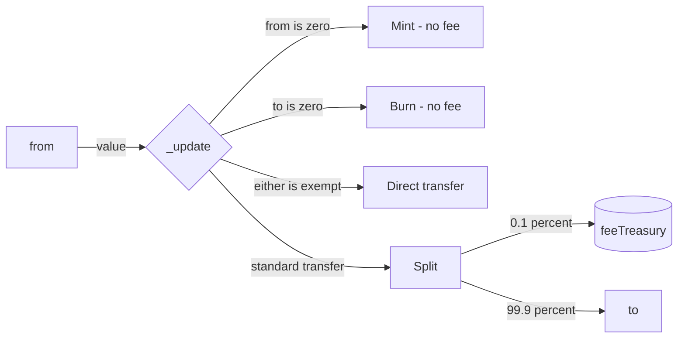

### 3.4 Post-Cap Inflation

The post-cap regime is intentionally minimal: a slow linear drip to keep mining incentives alive after the curve closes. The Miner contract reads `DOGE.currentCap()` at every accrual; if the supply is below the moving cap, a tiny `postCapRatePerPathUSD` (default 0.2 TDOGE per pathUSD flowed) emission applies. If admin sets `yearlyInflation = 0`, the cap becomes flat and post-cap mining produces nothing.

### 3.5 Supply Allocation by Phase

The 210M mining supply is distributed across the four phases by their respective ranges:

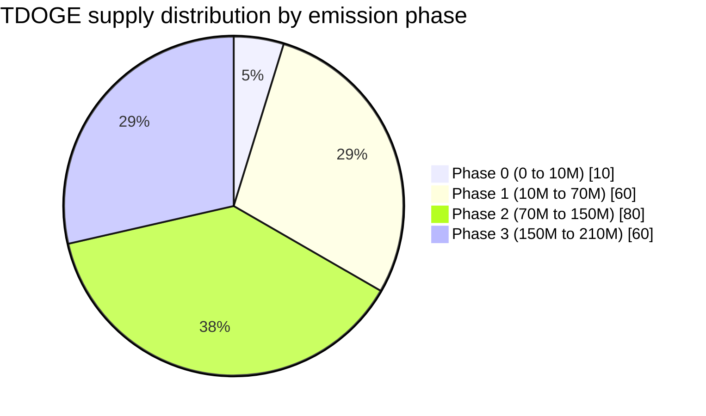

Phase 2 absorbs the largest portion (38.1% of supply) at a moderate rate, balancing distribution depth with scarcity preservation. Phase 0 is the smallest (4.76%) but uses the highest rate to reward bootstrap participants disproportionately for taking risk before the system has on-chain liquidity.

---

## 4. Mining Mechanism

### 4.1 Commit-Flow-Harvest Loop

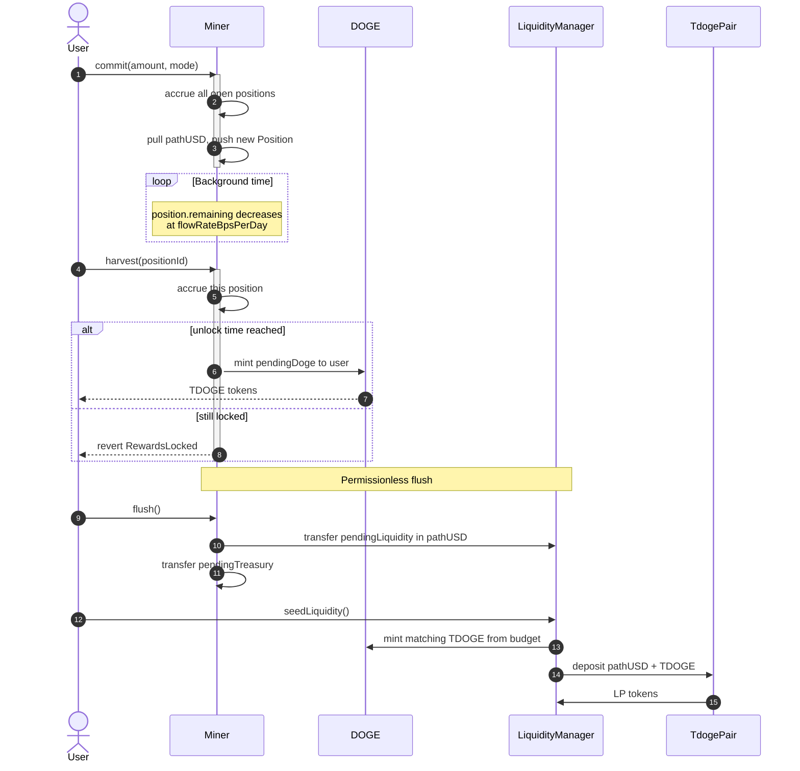

### 4.2 Multi-Position Model

Each call to `commit(amount, mode)` opens a **new Position** rather than topping up an existing one. A wallet may hold multiple positions in parallel, each with its own:

- `totalDeposited` — original commitment size
- `remaining` — pathUSD still to flow
- `lastUpdate` — accrual timestamp
- `mode` — chosen Harvest Mode index (0 = Instant, 1 = Monthly, 2 = Long-Term)
- `unlockAt` — earliest timestamp for harvest
- `pendingDoge` — accrued but unclaimed TDOGE
- `open` — closes on full conversion + claim

The per-wallet cap (default 10,000 pathUSD) applies to the **sum** of open positions' `totalDeposited`. There is also a `maxPositionsPerWallet` ceiling (default 10) for gas safety, since accrual loops across all open positions on commit.

### 4.3 Conversion Rate

Each open position converts pathUSD at a configurable `flowRateBpsPerDay` (default 200 bps = 2% per day, computed against the original `totalDeposited`). The flow accumulates **lazily** — it only updates state when the position is touched (commit, harvest, or accrue via another commit on the same wallet).

```
elapsed = block.timestamp - position.lastUpdate
flowed  = totalDeposited × flowRateBpsPerDay × elapsed / (BPS × SECONDS_PER_DAY)
flowed  = min(flowed, position.remaining)
```

At 2% / day a position drains to zero in 50 days exactly. A 100 pathUSD commitment flows 2 pathUSD per day for 50 days. Time spent without touching the position does not affect the eventual total — the user can ignore the position for 50 days and harvest once at the end with identical economics to a daily-poker.

### 4.4 Lazy Accrual: Why It Matters

Because flow only updates on touch, the protocol does not need a global per-second accumulator. Every position's state is purely local:

- A position never accrues when nobody is paying gas to update it.
- The `Miner` contract's storage stays bounded regardless of user count.
- Users who walk away and come back months later receive *exactly* what they would have received with continuous polling.

The trade-off: pending counters (`pendingLiquidity`, `pendingTreasury`) only reflect realised flow. The keeper (§12.1) is responsible for ensuring accrual happens often enough for liquidity to grow at human-timeframe granularity.

### 4.5 Sink Allocation

When pathUSD flows, it is split into two sinks:

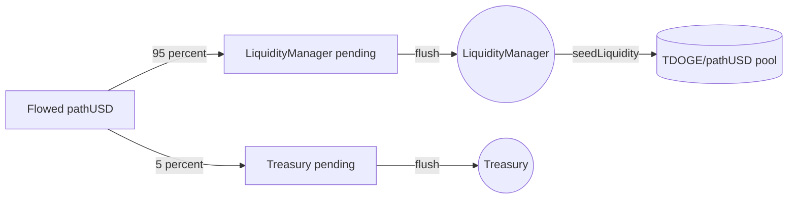

The split is parameterised (`liquidityBps`, `treasuryBps`) and must sum to 10,000. The default 95/5 reflects the design priority that the protocol owns its liquidity rather than paying out the conversion to a treasury wallet.

### 4.6 Position State Machine

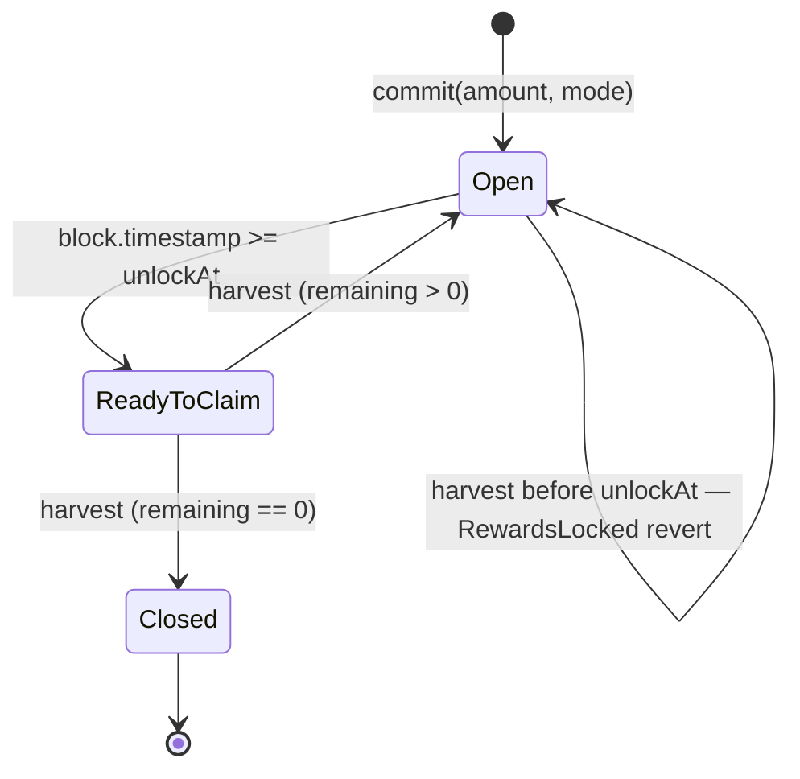

A Position lives through three meaningful states: `Open` (pre-unlock or unclaimed-but-still-active), `ReadyToClaim` (unlock passed), and `Closed` (fully drained and final harvest done). The slot is freed only on Closed; new commits open new positions until the cap.

---

## 5. Emission Curve

### 5.1 Phase Structure

The emission curve is **supply-based**, not time-based. The active rate is determined by the current `DOGE.totalSupply()` at the time of accrual.

| Phase | Supply range | Rate (TDOGE / pathUSD) | Intent |
|---|---|---|---|
| 0 | 0 → 10M | **200** | Bootstrap |
| 1 | 10M → 70M | 100 | Early growth |
| 2 | 70M → 150M | 40 | Stabilisation |
| 3 | 150M → 210M | 10 | Scarcity |
| Post-cap | 210M+ | 0.2 | Long-tail incentive bounded by `currentCap()` |

### 5.2 Curve Diagram

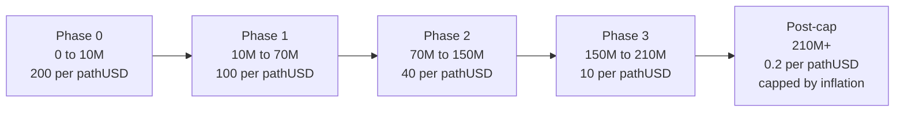

### 5.3 Boundary-Crossing Accrual

A single accrual can span multiple phases. The contract handles this exactly: it walks the phase table, consuming as much of the flow as the current phase has headroom for, then advances to the next phase with the remainder. This guarantees that the supply ceiling for a phase is never exceeded by even one wei.

### 5.4 Worked Example: Boundary Cross

Assume current `totalSupply = 9,950,000` TDOGE (Phase 0, 50,000 of headroom remaining), and a single accrual would naturally emit 300 TDOGE under Phase 0 rate parameters.

Step-by-step:

1. Phase 0 has `headroom = 10,000,000 - 9,950,000 = 50,000`.
2. The accrual's natural emission of 300 TDOGE fits within headroom → emit 300 TDOGE at Phase 0 rate. Done.

Now assume the accrual would naturally emit 80,000 TDOGE under Phase 0:

1. Phase 0 headroom = 50,000. Natural emission 80,000 > 50,000.
2. Emit exactly 50,000 TDOGE in Phase 0. Compute pathUSD-equivalent consumed: `flowUsed = 50,000 / 200 = 250 pathUSD`.
3. Subtract from remaining flow. Advance to Phase 1.
4. Recompute remaining-flow's emission at Phase 1's 100/pathUSD rate.

The user receives the proper sum; supply lands exactly at 10,000,000 (the phase boundary) before crossing.

### 5.5 Post-Cap Behavior

Once supply reaches 210M, mining continues at the much-reduced post-cap rate, but every emission is bounded by `DOGE.currentCap()` — which itself only grows at the configured yearly inflation. If admin pauses inflation, `currentCap()` is flat and post-cap emissions become impossible.

This is intentional: post-cap mining keeps the engine running for engagement, but it cannot inflate supply faster than the chosen yearly rate. The 0.2 default rate × the protocol's expected daily flow puts emission well below the inflation ceiling under any realistic scenario.

---

## 6. Harvest Modes

### 6.1 Three Modes

| Mode | Boost | Lock | Intent |
|---|---|---|---|
| 0 — Instant | 1.00× | none | Liquidity for active traders |
| 1 — Monthly | 1.20× | 30 days | Mid-term commitment |
| 2 — Long-Term | 1.50× | 180 days | Maximum boost, patient capital |

Mode is **chosen at the moment of commit** and stored on the Position. It cannot be changed later for that position. Subsequent commits open new positions and can pick different modes.

### 6.2 Cycle Lifecycle

A position's cycle traverses (see §4.6 state machine).

A position closes when:
1. `remaining` reaches zero (all pathUSD has flowed), AND
2. The user calls `harvest()` once unlocked — which mints the final pending TDOGE and flips `open = false`.

A closed position's slot frees up and can be replaced by a new `commit()` (subject to the `maxPositionsPerWallet` ceiling).

### 6.3 Compounding Multipliers

Harvest Mode is one of four multiplier inputs. They compose multiplicatively. See §7 for the full system.

### 6.4 Why Three Lock Tiers

The mode set was chosen to span three distinct user archetypes:

| Archetype | Mode | Why |
|---|---|---|
| Active trader | Instant | Wants TDOGE liquid the moment it accrues, willing to accept the lowest boost. |
| Patient holder | Monthly | Accepts a 30-day pause for a 20% premium. Reasonable for a believer. |
| Conviction stake | Long-Term | 180-day lock for 50% premium. Signals intent to hold beyond a single market cycle. |

Adding more tiers would dilute the signalling. Removing one would force users into a worse fit. The three-tier set has the shortest description that still maps onto distinguishable behaviours.

---

## 7. Multiplier System

### 7.1 Components

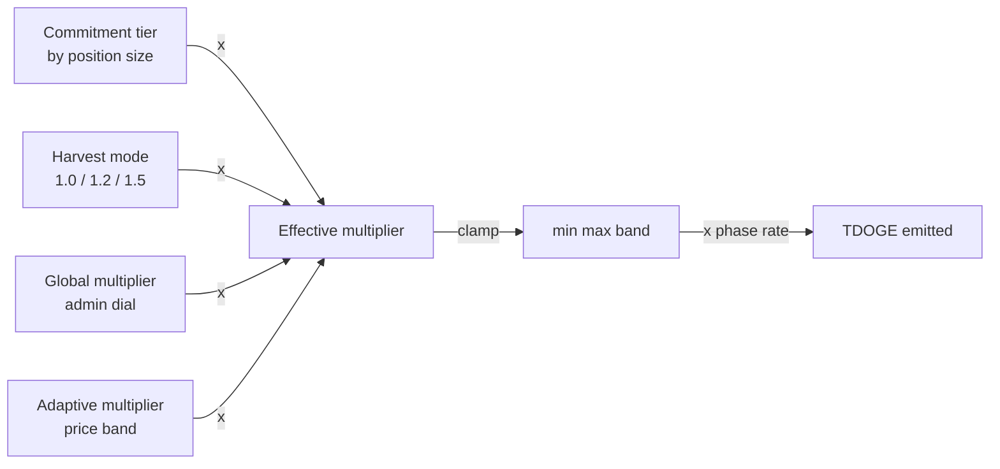

### 7.2 Commitment Tier

Per-position size determines a tier:

| Position size (pathUSD) | Boost |
|---|---|
| < 100 | 1.00× |
| 100 to 999 | 1.10× |
| 1,000 to 4,999 | 1.25× |
| 5,000 and above | 1.50× |

Tiers are stored as a sorted array on the contract; admin may replace the table. The effective tier is determined per-position at the time of accrual using that position's `totalDeposited`.

### 7.3 Adaptive Multiplier (Profitability Band)

The adaptive layer is a soft mechanism to keep mining value-per-pathUSD near a configured target, even as the active phase rate drops. It uses an admin-set reference TDOGE price (in pathUSD per whole TDOGE, 1e18-scaled). The contract computes:

```
valueOut    = phaseRate × referencePrice / 1e18                // pathUSD value of 1 pathUSD committed
adaptiveBps = targetValueBps × 1e18 / valueOut                // raw scaling factor
adaptiveBps = clamp(adaptiveBps, adaptiveMinBps, adaptiveMaxBps)
```

Defaults: `targetValueBps = 10_000` (1.0 pathUSD value per pathUSD committed), `[adaptiveMinBps, adaptiveMaxBps] = [8_000, 11_000]` — the multiplier can soften to 0.80× or stretch to 1.10×, no further. When `adaptiveEnabled = false` or `referenceTdogePrice = 0`, the adaptive component returns 1.00×.

### 7.4 Effective Multiplier Bounds

The product of all four multipliers is clamped to `[minEffectiveMultBps, maxEffectiveMultBps]` (defaults 0.25× / 10×). This guarantees that no parameter combination — even an adversarial admin update — can take emissions outside this band.

### 7.5 Worked Example

A wallet commits **2,000 pathUSD** in Long-Term Mode during Phase 0:

| Component | Value |
|---|---|
| Phase rate (Phase 0) | 200 TDOGE / pathUSD |
| Commitment tier (1,000–4,999) | 1.25× |
| Harvest Mode (Long-Term) | 1.50× |
| Global multiplier | 1.00× |
| Adaptive (disabled) | 1.00× |
| **Effective multiplier** | **1.875×** |
| **Effective rate** | **375 TDOGE / pathUSD** |

Daily flow at 2%/day = 40 pathUSD. Daily emission = 40 × 375 = **15,000 TDOGE**. Rewards lock for 180 days; on unlock the user can claim or continue accruing.

### 7.6 Derivation of the Combined Formula

The full per-accrual emission is:

```
flowed       = totalDeposited × flowRateBpsPerDay × elapsed / (BPS × SECONDS_PER_DAY)
multBps      = clamp(commBps × globalBps × modeBps × adaptiveBps / BPS^3,
                     minEffectiveMultBps, maxEffectiveMultBps)
emission     = flowed × phaseRate × multBps / (pathUSDUnit × BPS)
```

Where `pathUSDUnit = 10^pathUSDDecimals` (1e6 for Tempo's pathUSD). This formula is decimal-aware: `flowed` is in pathUSD-wei (6-dec), `phaseRate` is "TDOGE per whole pathUSD" (18-dec), and the result is in TDOGE-wei (18-dec).

The clamp on `multBps` is the safety rail. Even if adaptive misbehaves, an admin sets a runaway `globalMultiplier`, or speed tiers are replaced with extreme values, the per-emission output cannot exceed `maxEffectiveMultBps × phaseRate × flowed`. With defaults that ceiling is 10× the base phase rate.

---

## 8. Liquidity System

### 8.1 The Constant-Product Pair

`TdogePair.sol` implements a Uniswap V2-style AMM for TDOGE / pathUSD specifically. Token addresses are sorted at deploy. LP tokens are the pair contract itself (`DOGE FORGE LP`, symbol `DFLP`). 0.30% of every swap is retained by LPs through the standard k-invariant adjustment.

Why a custom AMM? Tempo's enshrined DEX is a stablecoin-only orderbook with prices clamped to ±2% of parity (`PRICE_SCALE = 1e5`, ticks ±2000). It cannot price a volatile asset against a stablecoin. We deploy a constant-product pair in EVM contract space for the volatile pair, and route stable-to-stable trades to the enshrined DEX.

### 8.2 Automated Liquidity Loop

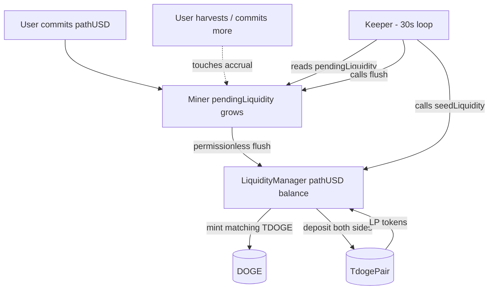

The keeper is a 30-second backend loop. Each tick:

1. Read `Miner.pendingLiquidity` and `pendingTreasury`. If non-zero, call `Miner.flush()`.
2. Read `pathUSD.balanceOf(LiquidityManager)`. If non-zero, call `LiquidityManager.seedLiquidity()`.

The keeper requires no special privilege — both calls are permissionless. It is operationally convenient, not a trust assumption. If the keeper goes offline, anyone can call those functions directly to settle accumulated liquidity.

### 8.3 LM Mint Budget

`LiquidityManager.dogeMintBudget` is the maximum TDOGE the LM may mint over its lifetime to provision the pair's TDOGE side. It is set at deploy (default 21,000,000 — 10% of cap) and counts toward the 210M ceiling. If the budget is exhausted, future seed calls revert with `BudgetExceeded` and an admin must increase it.

### 8.4 Initial Price vs Pool Mirror

On the very first `seedLiquidity()` (pool is empty), LM uses the admin-set `initialDogePerPathUSD` (default 100 TDOGE per pathUSD) to size the TDOGE side. On subsequent seeds, LM mirrors the current pool ratio so liquidity adds at the prevailing market price without slippage.

### 8.5 Liquidity Growth Trajectory

Assume a steady state with `N` users, each holding an average open position of `D` pathUSD, all in Instant mode for simplicity. Daily pathUSD flow into the protocol is:

```
F_daily = N × D × flowRateBpsPerDay / 10000
```

Of which 95% (default) routes to LM, becoming the daily new pathUSD entering the pool:

```
P_daily_in = F_daily × 0.95
```

If the keeper runs and seeds every tick, the pool grows at:

```
ΔReserve_pathUSD per day = P_daily_in
ΔReserve_TDOGE   per day = P_daily_in × poolPriceRatio   // at current pool price
```

With 100 users averaging 500 pathUSD in commitments, daily flow is `100 × 500 × 0.02 = 1,000 pathUSD`. After a 30-day period, the pool gains `1,000 × 0.95 × 30 = 28,500 pathUSD` of one-sided value plus the matching TDOGE side, for a total liquidity addition of `~57,000 pathUSD-equivalent`.

This compounds into the price surface: as the pool grows, the slippage of any given trade size shrinks. The system is self-reinforcing: more mining → more liquidity → tighter market → more usage.

### 8.6 LP Token Ownership

The LP tokens issued by `TdogePair.mint` are held by `LiquidityManager` (the caller). LM never burns them autonomously — the protocol owns its liquidity by default. Future governance can decide whether to:

- Hold LP indefinitely (current behaviour).
- Distribute LP to long-term holders, treasury, or community.
- Burn LP slowly to give back to the pool (rare, but possible).

The choice is post-launch and reversible. Until governance acts, all LP from mining flow accrues to LM.

---

## 9. Trading Layer

### 9.1 Routing Logic

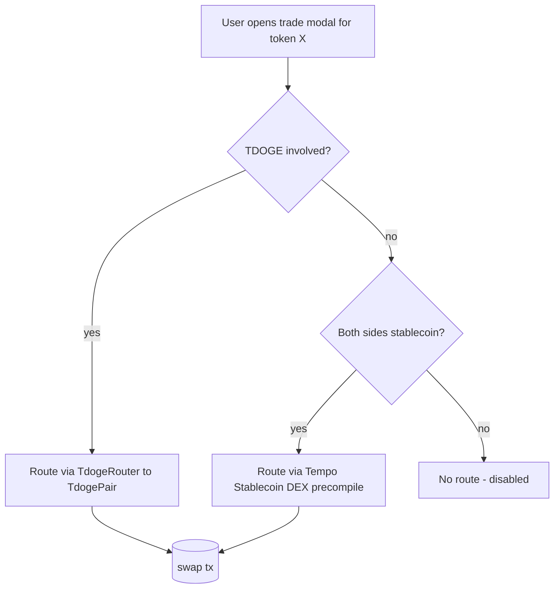

The frontend determines the route at quote time. Approval is set on the corresponding spender (`TdogeRouter` or the DEX precompile address). Settlement happens on the chain in a single transaction; DOGE FORGE never custodies funds during a swap.

### 9.2 TdogeRouter (AMM swaps)

`TdogeRouter.swapExactIn(tokenIn, amountIn, minOut, to, deadline)` does three things in one transaction:

1. `transferFrom` the user's input token to the pair.
2. Compute the output via the V2 fee-adjusted formula.
3. Call `pair.swap(amount0Out, amount1Out, to)`.

The router holds no funds and has no privileged state. `getAmountOut` and `quote` view methods let the UI render slippage estimates without simulating a transaction.

### 9.3 Tempo Enshrined DEX

For stable-to-stable swaps (e.g. pathUSD ↔ AlphaUSD), the frontend calls `IStablecoinDEX.swapExactAmountIn(tokenIn, tokenOut, amountIn, minOut)` directly on the precompile. The DEX is an orderbook, so liquidity depth depends on resting orders placed by makers — DOGE FORGE does not seed this; Tempo's broader ecosystem does.

### 9.4 Slippage Model

The trade modal exposes 0.5% / 1% / 3% / 5% slippage presets. `minOut` is computed as `quoteOut × (10_000 - slippageBps) / 10_000`. If executed price diverges past the preset, the swap reverts at the chain level — funds remain with the user.

### 9.5 Failure Modes

| Failure | Cause | UX outcome |
|---|---|---|
| `K` invariant violation | Sandwiching or stale quote | Tx reverts, user retries with fresh quote |
| `InsufficientLiquidity` | Pool empty or one side near-zero | Disabled in UI when reserves below threshold |
| `InsufficientOutput` | Slippage exceeded | Tx reverts, user widens slippage |
| `ExpiredDeadline` | Wallet held tx >5 min | Tx reverts, user resubmits |
| Tempo DEX `BelowMinimumOrderSize` | Stable swap < `MIN_ORDER_AMOUNT` (100 pathUSD) | Frontend warns before submission |

---

## 10. .tdoge Identity Registry

### 10.1 What It Is

`TdogeNames.sol` is a flat on-chain registry binding lowercase alphanumeric names (`a-z`, `0-9`, `-`, 1–20 chars, no leading/trailing hyphen) to wallet addresses. Each entry is displayed as `name.tdoge`. **It is not an NFT**: there is no ERC-721 contract, no transferable token. It is a status layer.

The registry imposes no impact on mining: holding a name does not affect emission rate, multipliers, fees, or any economic parameter elsewhere.

### 10.2 Eligibility & Cost

| Property | Value |
|---|---|
| Total supply | 5,000 |
| Eligibility | Any wallet with `Miner.positionCount(user) > 0` |
| Cost | 0.10 pathUSD (admin-tunable) |
| Fee destination | `LiquidityManager` (100% routed to TDOGE liquidity) |
| Mints per wallet | 1 |
| Name uniqueness | Enforced at contract level |

### 10.3 Liquidity-Routed Fees

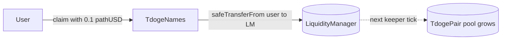

Each claim is a small, additive deposit into the liquidity pool. 5,000 names × 0.10 pathUSD = 500 pathUSD of bonus liquidity if the registry fills, on top of the mining-driven baseline.

### 10.4 Identity Economics

The registry creates three distinct effects:

1. **Direct deflationary action**: every claim spends 0.10 pathUSD that is routed to liquidity, growing the pool's pathUSD side by exactly the spent amount. Unlike most "name service" tokens that route fees to treasury or burn, every claim here is a small, additive provision-of-liquidity event.
2. **Status signal**: a `name.tdoge` persists across the app — header, leaderboard, mining page, portfolio. It functions as a public on-chain badge of early participation.
3. **Coordination primitive for future products**: future drops, governance, or PFP collections can read `nameOf(address)` to determine eligibility without re-doing whitelisting. The registry becomes the single source of truth for "who is a participant" in the DOGE FORGE community.

The 5,000 cap is intentional: it creates scarcity (statistically only the first ~5K committers can claim) without being so small as to be elitist.

---

## 11. Token Discovery

### 11.1 Indexer Architecture

The backend runs a token discovery service that scans Tempo blocks for contract creations, probes each new contract for ERC-20 / TIP-20 compliance (`symbol`, `name`, `decimals`), and persists discoveries into a SQLite store. Discovered tokens land in the `unverified` bucket by default.

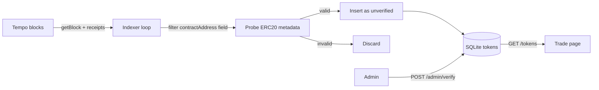

### 11.2 Verification

An admin endpoint (`POST /admin/verify`) flips the `verified` flag on a token. Verified tokens render alongside the curated list in the Trade UI; unverified ones render in a separate section with a "verify before trading" disclaimer. Verification is purely a UX signal — it does not change anything on-chain.

### 11.3 Discovery → Trading

Discovered stablecoins gain a trade route automatically once verified, since they can route through the Tempo enshrined DEX (assuming a book exists for the pair). Volatile tokens require a separate AMM pair contract — DOGE FORGE does not deploy pairs for arbitrary discovered tokens (out of scope), so they remain View-only.

In a future phase the discovery indexer will additionally query Tempo's DEX `books(pairKey)` for each token and surface the depth as a tradeable signal in the UI.

---

## 12. Operational Tooling

### 12.1 Liquidity Keeper

A 30-second loop running in the backend that calls `Miner.flush()` and `LiquidityManager.seedLiquidity()` whenever there is balance to move. Key properties:

- **Permissionless**: the keeper holds no special role; any address can replicate it.
- **Cost-bounded**: idle ticks make two view calls and exit; non-idle ticks pay gas for one or two transactions.
- **Stateless**: no off-chain queue; the contracts themselves track what is pending.

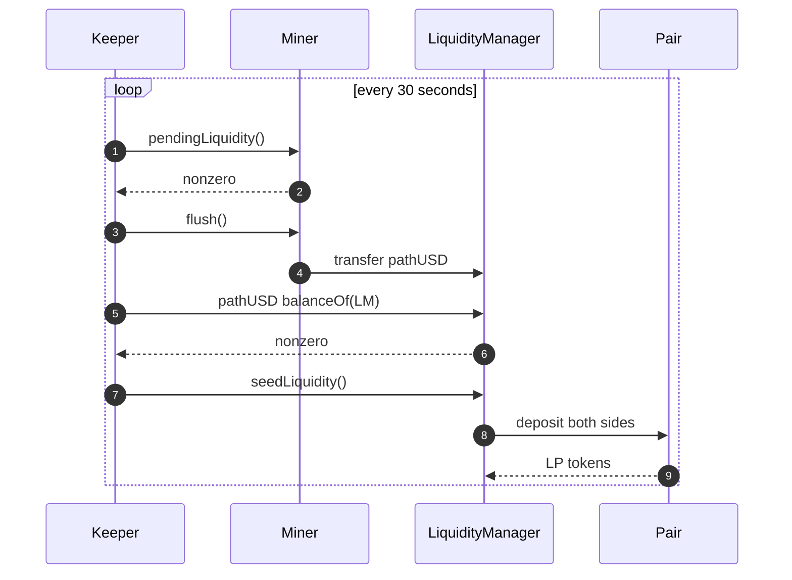

### 12.2 Token Discovery Indexer

A second loop that walks recent block ranges for contract-creation transactions, probes ERC-20 metadata, and stores discoveries. Configurable parameters:

- `INDEXER_RANGE` — blocks per scan tick (default 200)
- `INDEXER_POLL_MS` — sleep between ticks (default 10s)
- `INDEXER_START_BLOCK` — bootstrap cursor (default: head − range)

The indexer is also stateless; cursor is persisted to SQLite. Restarting picks up exactly where it left off.

### 12.3 Frontend Architecture

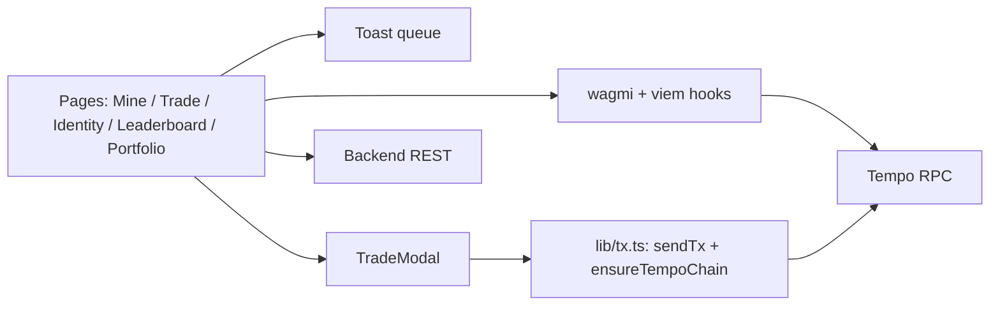

`lib/tx.ts` centralises chain switching (with EIP-3085 add-chain fallback) and write-tx wrapping so every page submits transactions through the same path. This means a single bug fix in chain handling propagates everywhere.

### 12.4 Failure Modes & Recovery

| Failure | Effect | Recovery |
|---|---|---|
| Keeper offline | pathUSD accumulates in Miner; no liquidity growth | Anyone can call `flush()` + `seedLiquidity()` directly |
| Indexer offline | New tokens stop being discovered | Restart indexer; cursor resumes |
| Backend offline | Trade page shows curated list only | Pages still function; unverified bucket empty |
| RPC unavailable | All on-chain reads fail | Retry; viem auto-retries |
| Wallet on wrong chain | Reads pinned to Tempo work; writes prompt switch | Chain-switch banner + auto-trigger |

The architecture is designed so any single off-chain component can fail without breaking the on-chain state. The contracts are the source of truth.

---

## 13. Security Model

### 13.1 Admin Powers and Constraints

| Power | Scope | Hard Bound |
|---|---|---|
| Mint TDOGE | `Miner` and `LiquidityManager` only (whitelisted minters) | `currentCap()` always enforced inside `DOGE.mint` |
| Pause Miner | Stops `commit` and `harvest` | Cannot move user funds |
| Tune emission curve | Replace phase table | Cannot exceed `INITIAL_CAP` per phase threshold |
| Tune multipliers | Speed tier, modes, global, adaptive | Combined product clamped to effective band |
| Set transfer fee | DOGE | Hard ceiling 0.20% |
| Set yearly inflation | DOGE | Hard ceiling 5% of cap |
| `adminWithdrawPathUSD` | Miner | **Pulls any pathUSD held by Miner contract** — operator concession to recover stuck funds |

The `adminWithdrawPathUSD` function is the most concentrated admin power: it allows the operator to drain pathUSD held by Miner (typically funds in transit between accrual and `flush`). It exists because Miner holds user-deposited capital and there must be a path to recover funds in a stuck-state scenario. The plan is to migrate ownership of `Miner` and `DOGE` to a multisig before the system handles material TVL. This is documented as a known constraint, not hidden.

### 13.2 Reentrancy and Safe Transfers

Every state-mutating function on `Miner`, `LiquidityManager`, `TdogePair`, and `TdogeNames` carries `nonReentrant`. All ERC-20 calls go through OpenZeppelin's `SafeERC20` so non-standard token return values cannot break flows.

### 13.3 Cap Enforcement Layers

Three layers guarantee TDOGE supply cannot exceed the configured ceiling:

1. **`DOGE.mint`** rejects any mint that would push `totalSupply` above `currentCap()`.
2. **`Miner._computeEmission`** clamps emission at the active phase's headroom and the post-cap headroom (`currentCap() - supply`).
3. **`LiquidityManager.seedLiquidity`** rejects mints that exceed its dedicated `dogeMintBudget`.

A revert in any of these would leave the system in a consistent state — pathUSD already deposited is not lost, only the over-cap mint is rejected.

### 13.4 Path to Multisig

The launch admin is a single EOA. Before the protocol holds material value:

1. Deploy a 3-of-5 (or similar) Safe multisig.
2. Transfer ownership of `DOGE`, `Miner`, `LiquidityManager`, `TdogeNames` via `transferOwnership`.
3. Rotate the keeper key and document operational runbook.

---

## 14. Threat Model

### 14.1 Attack Surface Map

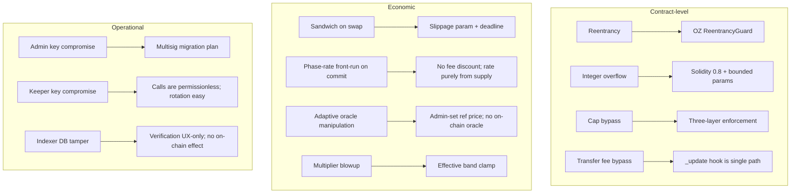

### 14.2 Specific Vectors

**Sandwich attack on swap.** A bot front-runs a user's swap, moves the price unfavourably, lets the user execute, then back-runs to revert the price. Mitigations: per-tx slippage param (default 1% in UI), deadline enforcement, no MEV protection at the protocol level (Tempo's mempool dynamics are an open question).

**Adaptive multiplier oracle drift.** The reference TDOGE price is admin-set, not oracle-fed. If the admin sets a stale or wrong price, emissions drift away from market-equilibrium. Mitigation: bounded by `[adaptiveMinBps, adaptiveMaxBps]` — even a wildly wrong price can only push the multiplier ±20% from neutral by default.

**Phase-rate gaming.** Could a user time their commit to land at a phase boundary and capture the higher rate before crossing? Yes, if they harvest exactly at the right moment — but the boundary-crossing logic in `_computeEmission` exactly splits the emission at the boundary, so the gain equals what they'd naturally receive. There is no exploit, only optimal play.

**Per-wallet cap bypass via multiple wallets.** A user with funds can split into N wallets and effectively raise their cap N-fold. This is acknowledged: the cap is a soft anti-whale signal, not a hard sybil-resistant constraint. Sybil-resistance would require off-chain identity (out of scope).

**Pair manipulation pre-seed.** Before the LM has seeded liquidity, the pair's reserves are zero. A malicious actor could front-run the first `seedLiquidity()` by directly transferring tokens to the pair and calling `mint(self)` to capture the initial LP at any ratio they choose. Mitigation: the LM mints the very first liquidity itself, in a transaction from the operator. The window between deploy and first-seed is the only vulnerable period and is covered by ops procedure.

**Transfer-fee griefing.** A user could attempt to grief by sending TDOGE in a way that breaks fee accounting. Mitigation: the `_update` override is the single path for all balance changes (transfer/mint/burn) and handles every case explicitly. Mint and burn skip fee; exempt addresses skip fee; everything else pays exactly the configured fraction.

### 14.3 Mitigations Already In Place

- ReentrancyGuard on every state-mutating external function.
- SafeERC20 for all token transfers.
- Hard ceilings on fee (0.20%), inflation rate (5%/yr), effective multiplier band.
- Three-layer cap enforcement.
- Pause switch as circuit breaker.
- All admin actions emit events (auditability).

### 14.4 Open Risks

- **Single admin EOA at launch.** Highest priority to migrate to multisig.
- **No external audit yet.** Code is open and tested but not professionally reviewed.
- **First-seed window**: see vector 5 above.
- **Tempo precompile dependency**: a future Tempo upgrade could change DEX precompile interface, requiring our swap UI to adapt.

---

## 15. Treasury and Fee Policy

### 15.1 Revenue Streams

The protocol generates value into two destinations:

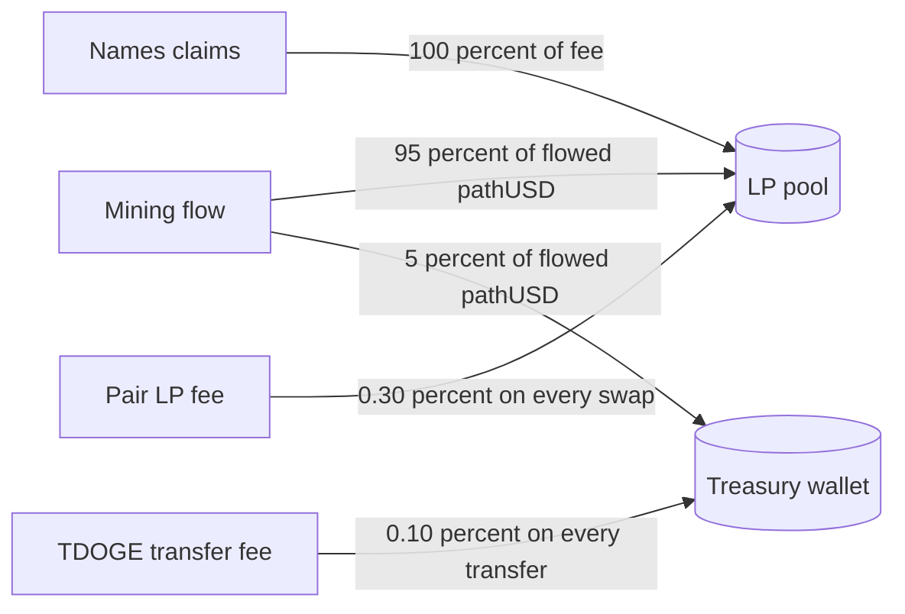

The split is intentional: **liquidity gets 100% of identity revenue and 95% of mining revenue**; treasury gets 5% of mining and the residual transfer fee revenue. Liquidity is treated as the primary public good of the protocol; treasury is an operational reserve.

### 15.2 Fee Routing

| Source | Destination | Mechanism |
|---|---|---|
| Mining flow (95%) | LP pool via `LiquidityManager` | `Miner.flush` → `LM.seedLiquidity` |
| Mining flow (5%) | Treasury wallet | `Miner.flush` |
| `.tdoge` claim fees | LP pool via `LiquidityManager` | `TdogeNames.claim` → direct safeTransferFrom to LM |
| TDOGE transfer fee | Treasury wallet | `DOGE._update` hook |
| Swap fee | LP holders (LM is the only LP currently) | Standard k-invariant retention |

### 15.3 Use of Treasury Funds

Treasury holds:
- 5% share of mining-converted pathUSD.
- TDOGE transfer fees (in TDOGE).

Both are held in an EOA / multisig at the chain level. There is no on-chain governance over treasury spending today. Acceptable uses are documented as:

1. Operations cost (RPC, hosting, audits).
2. Bootstrapping liquidity in market dislocations (admin discretion within multisig).
3. Future programs (rewards, grants, contributors).

A formal treasury policy will accompany the multisig migration.

### 15.4 TDOGE Burn Mechanics (Future)

A planned post-launch enhancement: route a portion of TDOGE transfer fees (or all of them) into a periodic burn rather than treasury. The burn would reduce `totalSupply` and effectively counter the post-cap inflation.

This is not yet implemented. Implementation notes:
- The `feeTreasury` could be a small burner contract that calls `DOGE.burn(self balance)` on a schedule.
- Or the `feeBps` could be split into `burnBps` and `treasuryBps` natively in `DOGE._update`.

The choice and timing of this is a governance decision pending after multisig migration.

---

## 16. Comparative Analysis

### 16.1 vs Pure Mining Tokens

Compared to a token whose only property is "stake X to earn Y":

| Property | Pure mining | DOGE FORGE |
|---|---|---|
| Supply cap | Often missing or symbolic | Hard 210M, layered enforcement |
| Liquidity bootstrapping | User-funded LP, often abandoned | Protocol-owned, automatic from flow |
| Reward differentiation | One rate for everyone | Commitment tier × Harvest mode × global × adaptive |
| Identity | None | `.tdoge` registry |
| Adaptive emissions | Static | Reference price + bounded scaling |

### 16.2 vs Bonding Curve Launches

Bonding curves provide instant liquidity but mint supply on every buy, often without a meaningful ceiling. They reward early participants through price slope, not protocol structure.

DOGE FORGE inverts this: supply emission is rate-limited (2%/day max per position), liquidity grows from production rather than from speculation, and the reward differential between early and late comes from supply-based phase rates rather than price-curve mechanics.

### 16.3 vs Stake-to-Earn

Classical stake-to-earn sees users lock token A to receive token B. Token A is usually pre-existing and externally priced. DOGE FORGE inverts the asset roles: users commit a stable (pathUSD), receive a freshly-minted volatile (TDOGE), and the protocol uses the stable to seed the market for the volatile. The system is effectively a productized DEX-launch with a 50-day per-position vesting cycle.

### 16.4 vs Memecoin Launches

Most memecoin launches are a one-shot mint to a single LP position. Holders speculate, the LP is volatile, and there is no mechanism for liquidity to grow organically.

DOGE FORGE keeps the meme aesthetic (TDOGE branding, .tdoge identity) but installs an underlying mechanism that converts speculative interest into protocol-owned liquidity. Every commit grows the pool. The pool is never extracted.

---

## 17. Roadmap

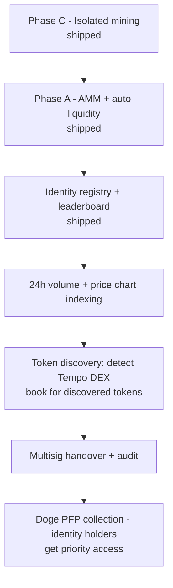

| Phase | State | Description |
|---|---|---|
| C — Isolated mining | shipped | Miner, emission curve, harvest modes, multipliers, treasury accumulation |
| A — Liquidity loop | shipped | TdogePair, LM, Router, automated keeper, in-app swap |
| Identity + Leaderboard | shipped | `.tdoge` claims with fee-to-liquidity routing, public ranking |
| Volume / chart | next | Backend indexes Pair `Swap` events for 24h volume + sparkline charts on tiles |
| Discovery enrich | next | For each discovered token, query Tempo DEX `books()` and enable swap if a book exists |
| Multisig + audit | pre-mainnet | Ownership migration and external review |
| PFP collection | future | Optional ERC-721 layer, priority for `.tdoge` holders |

---

## 18. Risks and Disclosures

This system is on testnet. Material risks before mainnet deployment include:

- **Centralisation at launch.** A single EOA controls upgrades and parameters. The path to multisig is documented but not yet executed.
- **Admin rescue power.** `adminWithdrawPathUSD` allows the operator to remove pathUSD held by `Miner`. Until ownership migrates, users should size positions accordingly.
- **AMM pricing risk.** The custom pair has no oracle. The first seed sets the initial price; subsequent trades discover price freely. Manipulation requires capital; large enough capital can move the price.
- **Tempo precompile assumptions.** The Stablecoin DEX is treated as a fixed protocol primitive at `0xDEc0…`. If Tempo changes its address or interface in a future upgrade, the swap UI for stable-to-stable pairs would need a contract update.
- **Smart contract risk.** All code is open and tested but unaudited. Tests cover happy paths, boundary conditions, and adversarial cases included in this whitepaper.
- **Memetic narrative risk.** TDOGE is a meme-flavoured token. Price action will reflect speculative interest more than fundamentals, especially in the bootstrap phase. Users should treat all participation as voluntary risk.

This whitepaper is not investment advice. DOGE FORGE is a permissionless protocol; participants are responsible for their own decisions and key custody.

---

## 19. Appendix

### A. Deployed Addresses (Tempo Testnet, chain 42431)

| Contract | Address |
|---|---|
| TDOGE | `0x33eef32099afa93f9b52f14a7858f0ea15dd5f2d` |
| Miner | `0xa0fc97a102bdf39039cf09094811ef39995066ab` |
| TdogePair | `0x0993867099f6db1341fa70ad6e355d756aff8c12` |
| LiquidityManager | `0x7317ab8ddd23c63f0187740c1a75e1570ad2f9ba` |
| TdogeRouter | `0x35f699a6b8c40cd5019dbb6d6dae9e9f92f9538c` |
| TdogeNames | `0xe6ab2beedb8bad8d1fbb15cf6cec4fa50886f825` |
| pathUSD (Tempo predeploy) | `0x20c0000000000000000000000000000000000000` |
| Stablecoin DEX (Tempo precompile) | `0xDEc0000000000000000000000000000000000000` |

Explorer: `https://explore.testnet.tempo.xyz`.

### B. Function Catalogue (User-Facing)

**Miner**
- `commit(uint256 amount, uint8 mode) returns (uint256 positionId)`
- `deposit(uint256 amount) returns (uint256)` — alias for `commit(amount, 0)`
- `harvest(uint256 positionId)`
- `harvestAll()`
- `flush()` — permissionless
- `getPositions(address user) view returns (Position[])`
- `pending(address user, uint256 positionId) view returns (uint256 flow, uint256 doge, uint256 secsToUnlock)`
- `pendingAll(address user) view returns (uint256 openCount, uint256 totalCommitted, uint256 totalPending)`
- `currentPhase() view returns (uint256 index, uint256 ratePerPathUSD)`
- `effectiveMultiplierBps(address user, uint256 positionId) view returns (uint256 commitment, uint256 mode, uint256 global, uint256 adaptive, uint256 effective)`

**LiquidityManager**
- `seedLiquidity() returns (uint256 lp)` — permissionless
- `totalReceived() view returns (uint256)` / `totalDeployed()` / `dogeMinted()`

**TdogePair**
- `getReserves() view returns (uint112, uint112, uint32)`
- `mint(address to)`, `burn(address to)`, `swap(uint256 a0Out, uint256 a1Out, address to)`

**TdogeRouter**
- `swapExactIn(address tokenIn, uint256 amountIn, uint256 minOut, address to, uint256 deadline)`
- `swapExactOut(address tokenIn, uint256 amountOut, uint256 maxIn, address to, uint256 deadline)`
- `quote(address tokenIn, uint256 amountIn) view returns (uint256)`

**TdogeNames**
- `claim(string name)`
- `nameOf(address) view returns (string)`
- `displayNameOf(address) view returns (string)` — returns `<name>.tdoge` or empty
- `isEligible(address) view returns (bool)`
- `isNameAvailable(string) view returns (bool)`
- `resolveName(string) view returns (address)`

### C. Storage Layout (Selected)

**Miner.Position**

```
struct Position {
    uint256 remaining;       // pathUSD still to flow (token-wei)
    uint256 totalDeposited;  // original commitment (token-wei)
    uint64  lastUpdate;      // accrual timestamp
    uint64  unlockAt;        // earliest harvest timestamp
    uint8   mode;            // index into harvestModes
    bool    open;            // false once fully closed
    uint256 pendingDoge;     // accrued but unclaimed TDOGE (TDOGE-wei)
}
```

**Miner Globals**

```
mapping(address => Position[]) private _positions;
mapping(address => uint256)    public  minerScore;       // lifetime points (pathUSD-days)
uint256 public pendingLiquidity;  // pathUSD awaiting flush
uint256 public pendingTreasury;   // pathUSD awaiting flush
uint256 public totalFlowed;       // cumulative flowed pathUSD
```

**TdogePair Reserves**

```
uint112 private reserve0;  // sorted token0 reserve
uint112 private reserve1;  // sorted token1 reserve
uint32  private blockTimestampLast;
```

### D. Developer Quickstart

Clone, build, and test:

```bash
# contracts
cd contracts
forge install foundry-rs/forge-std --no-commit
forge install OpenZeppelin/openzeppelin-contracts --no-commit
forge build
forge test

# frontend
cd ../frontend
npm install
cp .env.example .env.local && $EDITOR .env.local
npm run dev

# backend
cd ../backend
npm install
cp .env.example .env && $EDITOR .env
npm run dev      # API on :4000
npm run indexer  # token discovery
npm run keeper   # liquidity flush + seed (requires KEEPER_PRIVATE_KEY)
```

Deploy fresh contracts to Tempo testnet:

```bash
cd contracts
source .env
forge script script/Deploy.s.sol:Deploy \
  --rpc-url $TEMPO_RPC_URL --broadcast --slow --gas-estimate-multiplier 700
```

Verify on Sourcify:

```bash
forge verify-contract --chain 42431 --verifier sourcify \
  --verifier-url https://contracts.tempo.xyz/ \
  --constructor-args $(cast abi-encode "<sig>" <args>) \
  <ADDR> <PATH>:<CONTRACT>
```

### E. Glossary

- **Accrual** — the act of updating a position's flowed amount and pendingDoge based on elapsed time. Lazy: only happens when the position is touched.
- **Cycle** — the lifecycle of a single Position from commit through full conversion to close.
- **Flow rate** — `flowRateBpsPerDay`. The percentage of the original commitment that converts each day.
- **Harvest Mode** — chosen at commit; controls reward boost and unlock delay.
- **Effective multiplier** — the combined product of commitment × mode × global × adaptive, clamped to the configured band.
- **Liquidity sink** — the destination that receives the 95% share of flowed pathUSD; the LiquidityManager.
- **Treasury sink** — the destination of the 5% share; the project treasury wallet.
- **Pair** — `TdogePair`, the constant-product AMM for TDOGE / pathUSD.
- **Enshrined DEX** — Tempo's protocol-level orderbook DEX at precompile `0xDEc0…`, used for stable-to-stable swaps.
- **TIP-20** — Tempo's stablecoin token standard (extends ERC-20 with payment-oriented features).
- **LM** — `LiquidityManager`. Holds incoming pathUSD, mints matching TDOGE, deposits into the pair.
- **Keeper** — backend loop that calls `flush` + `seedLiquidity` permissionlessly.
- **Identity** — a `.tdoge` name claimed via `TdogeNames`. Pure status; no economic effect.
- **Miner score** — cumulative points = Σ(committed × time-active / day). Used for ranking.
- **K-invariant** — the constant-product `reserve0 × reserve1 = k` rule that governs AMM swaps.

---

*DOGE FORGE Whitepaper · Version 1.1 · Tempo Chain*
